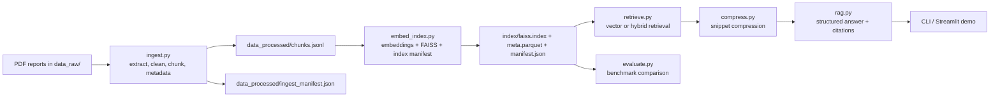

# RAG Consulting Knowledge System
[](LICENSE)

一个面向咨询研究、行业分析和政策阅读场景的端到端 RAG 项目。它把 PDF 报告重建为可复现语料，完成清洗、分块、向量索引、`vector` / `hybrid` 检索，并输出带证据引用的结构化回答。


## 项目目标

面向以下研究任务提供一个轻量但完整的工作流：

- 数字化转型与 AI 应用研究
- 行业报告和政策文件分析
- 管理咨询风格的问题检索与证据组织
- 带来源引用的结构化问答

## 适用场景

- 咨询面试中的行业/政策研究 demo
- AI / data / retrieval 工程岗位的个人作品集项目
- 小型研究语料库的可复现检索实验

## 系统做什么

- 从 `data_raw/` 中摄取 PDF 报告
- 清洗页面噪声并做结构感知分块
- 保留 `doc_id`、标题、来源、日期、页码和 section metadata
- 构建可复现的 FAISS 索引与 manifest
- 支持 `vector` 和 `hybrid` 两种检索模式
- 进行轻量证据压缩并生成带 citation 的结构化回答
- 提供 CLI、评估入口和 Streamlit 演示页面

正式构建约定：

- 正式语料重建只读取 `data_raw/`
- `data_raw_test/` 当前保留为重复样本目录，不参与正式 corpus build

## 架构概览



## 数据流

1. `src.ingest` 从原始 PDF 抽取文本、清洗页眉页脚噪声，并输出 chunk 级语料。
2. `src.embed_index` 使用显式 embedding backend 建立 FAISS 索引，并把上游 manifest 绑定进 index manifest。
3. `src.retrieve` 执行向量检索或混合检索，并做去重、多样性控制和轻量重排。
4. `src.compress` 从检索 chunk 中提取更窄的证据片段。
5. `src.rag` 组装上下文并输出结构化、带来源编号的回答。
6. `src.evaluate` 运行小型 benchmark，比对 `vector` 和 `hybrid`。

## 核心特性

- 可复现 ingestion 和 indexing：语料与索引都带 manifest 和兼容性检查
- 明确的 metadata 策略：每个 chunk 尽量保留文档标题、来源、日期、文件名、页码和 section
- 双检索模式：支持 `vector` 与 `hybrid`
- 检索清洁度优化：同页/同 section 去重、文档多样性惩罚、轻量 query coverage bonus
- 证据可追溯：回答输出引用来源，检索结果保留页码与 section

## Benchmark 快照

当前 benchmark 基于仓库内 3 份政策/研究 PDF 和 12 条人工设计问题，按文档级相关性评估。

| Mode | hit@5 | MRR | nDCG@5 | avg_unique_docs@5 | avg_front_matter_hits@5 |
|---|---:|---:|---:|---:|---:|
| `vector` | 1.0000 | 0.8333 | 0.8822 | 2.5000 | 0.1667 |
| `hybrid` | 1.0000 | 0.9583 | 0.9559 | 2.6667 | 0.0833 |

主要发现：

- `hybrid` 在政策名称、监管表述、机构名词这类词面锚定较强的问题上更稳。
- `vector` 在宽主题问题上并不总是更差；对少数 broad thematic query，`hybrid` 仍会把词面相近但主题偏掉的 chunk 排得过高。
- 这个 benchmark 能说明当前检索模式的相对差异，但不能证明系统已具备通用领域鲁棒性。

详见 [docs/benchmark_summary.md](docs/benchmark_summary.md)。

## 快速开始

### 1. 安装依赖

```bash
python3 -m venv .venv
./.venv/bin/pip install -r requirements.txt
```

系统依赖：

- `pdfinfo`
- `pdftotext`

当前 PDF 抽取依赖 Poppler 命令行工具。

### 2. 最短运行路径

仓库已经包含一份重建后的 `data_processed/` 和 `index/`。如果你只想快速验证项目是否能跑，安装依赖后直接执行：

```bash
./.venv/bin/python -m src.rag \
  --index_dir index \
  --emb_model local-hash-v1 \
  --mode hybrid \
  --top_k 5 \
  --query "How do the documents discuss international cooperation on AI governance?"
```

### 3. 从原始 PDF 全量重建

摄取：

```bash
./.venv/bin/python -m src.ingest \
  --input data_raw \
  --output data_processed/chunks.jsonl \
  --documents_out data_processed/documents.jsonl \
  --manifest_out data_processed/ingest_manifest.json \
  --fail_log data_processed/ingest_failures.jsonl \
  --skip_bad_pages
```

建索引：

```bash
./.venv/bin/python -m src.embed_index \
  --chunks data_processed/chunks.jsonl \
  --ingest_manifest data_processed/ingest_manifest.json \
  --out index \
  --model local-hash-v1
```

运行 benchmark：

```bash
./.venv/bin/python -m src.evaluate \
  --index_dir index \
  --questions eval/retrieval_benchmark.jsonl \
  --modes vector hybrid \
  --top_k 5
```

### 4. 启动 Streamlit demo

```bash
./.venv/bin/streamlit run app.py
```

## 推荐 demo 查询

推荐使用 [eval/demo_queries.jsonl](eval/demo_queries.jsonl) 里的 5 条问题，覆盖三类展示点：

- 政策命名与监管表述
- 跨文档治理/标准检索
- 一个刻意保留的 broad thematic counterexample

## 5 分钟 demo 流程

1. 用最短运行路径先展示一条 `hybrid` 问答结果，说明系统不是 notebook 原型，而是可直接运行的 CLI。
2. 展示 `data_processed/ingest_manifest.json` 和 `index/manifest.json`，说明语料和索引都可追溯、可复现。
3. 运行 `src.evaluate`，对比 `vector` 和 `hybrid`，指出 `hybrid` 在政策/监管类问题上的优势。
4. 再跑一条 broad thematic query，诚实说明当前系统在抽象主题检索上仍有误差。
5. 用一句话收尾：这个项目的价值在于“可复现 + 可解释 + 可演示”，而不是追求复杂 orchestration。

## 项目结构

```text
app.py
config/default.json
data_raw/
data_processed/
docs/
eval/
index/
src/
tests/
```

关键模块：

- `src/ingest.py`: PDF 抽取、清洗、分块、metadata 生成
- `src/embed_index.py`: embedding backend 选择、FAISS 建索引、index manifest
- `src/retrieve.py`: `vector` / `hybrid` 检索、去重、轻量重排
- `src/compress.py`: 证据压缩
- `src/rag.py`: 上下文组装与结构化回答输出
- `src/evaluate.py`: benchmark 运行入口

## Demo 与评估资产

- [eval/retrieval_benchmark.jsonl](eval/retrieval_benchmark.jsonl): 12 条带分类的评估问题
- [eval/demo_queries.jsonl](eval/demo_queries.jsonl): 推荐的 5 条演示问题
- [docs/benchmark_summary.md](docs/benchmark_summary.md): benchmark 摘要和误差分析
- [docs/interview_notes.md](docs/interview_notes.md): 面试说明素材

## 已知限制

- 当前只支持 PDF，未覆盖 DOCX / TXT
- metadata 依赖 PDF 内嵌字段质量；部分值仍会回退到文件名或 `unknown`
- 生成层仍是 extractive template，不是完整 LLM answer synthesis
- benchmark 很小，只能用于仓库内对比，不适合对外宣称“通用检索效果”
- citation 现在是 chunk / snippet 级，不是 token 级归因

## 后续工作

- 扩展更真实的 benchmark 和 query 分类
- 增加 DOCX / TXT ingestion
- 提升 broad thematic query 的检索鲁棒性
- 引入更细粒度的 evidence span 和 answer grounding
- 在不破坏可解释性的前提下评估更真实的 embedding backend
